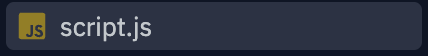
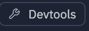

# JavaScript 기본

<!--
_footer: © 2024 by [Cha Haneum](https://github.com/chebread) is licensed under [CC BY 4.0](https://creativecommons.org/licenses/by/4.0/?ref=chooser-v1)
-->

---

# 목차

---

1. 실습 환경
2. Hello, world!
3. 코드 구조
4. 변수와 상수
5. 자료형
6. 형변환
7. 마무리 정리
8.  출처

---

# 0. 실습 환경

---

<div style="text-align: center">


[https://replit.com/](https://replit.com/)에 접속해주세요.

</div>

---

<div style="text-align: center">

</div>

<br/>
구글 또는 깃허브로 로그인해주세요.

---

<div style="text-align: center">

</div>
<br/>

`Create Repl` 버튼을 눌러주세요.

---

<div style="text-align: center">

</div>
<br/>

`HTML, CSS, JS`를 선택한 후 `Create Repl`를 눌러주세요.

---

<div style="text-align: center">

</div>
<br/>

`script.js`를 클릭해주세요.

---

<div style="text-align: center">

</div>
<br/>

`DevTools`를 클릭해주세요.

---

<div style="text-align: center">

</div>
<br/>

`Console`를 클릭해주세요.

---

# 1. Hello, world!


---

```js
console.log("Hello, world!")
```

<div style="text-align: center">

</div>

이것 처럼 코드를 작성한 후, 상단의 `run` 버튼을 눌러주세요.

<div style="text-align: center">

</div>

---

<div style="text-align: center">

</div>

`Console`에 들어가시면, 결과를 볼 수 있습니다.

---

참고: `console.log`는 [Web API](https://developer.mozilla.org/en-US/docs/Web/API/)가 지원하는 브라우저의 Console에 메시지를 띄우는 함수입니다.

---

## 2. 코드 구조


---

## 문(statement)

문(statement)은 어떤 작업을 수행하는 문법 구조(syntax structure)와 명령어(command)를 의미합니다.


---

```js
console.log('Hello'); console.log('World');
```
아래 코드는 'Hello World’를 두 개의 alert 문으로 나눈 예시입니다.

---

```js
console.log('Hello');
console.log('World');
```

코드의 가독성을 높이기 위해 각 문은 서로 다른 줄에 작성하는 것이 일반적입니다.

---

## 세미콜론(semicolon)

세미콜론(semicolon)은 하나의 구문(statement)과 그 다음 구문의 구분을 위한 용도, 정확히는 하나의 구문을 종결(statement terminator)하는 용도로 쓰입니다.

---


```js
console.log('Hello');
console.log('World');
```

줄 바꿈이 있다면 세미콜론(semicolon)을 생략할 수 있습니다.
그러나, 많은 개발자들은 가독성과 안전성 때문에 세미콜론을 생략하지 않습니다.

---

## 주석(comment)

주석(comment)은 해당 코드를 설명해주기 위해 작성합니다.

---

```js
// Hello, world!

/*
  Hello, world!
*/
```

한 줄짜리 주석은 두 개의 슬래시 `//`로 시작하여 표현할 수 있습니다.
여러 줄의 주석은 슬래시와 별표 /*로 시작해 별표와 슬래시 */로 끝내어 표현할 수 있습니다.

---

# 3. 변수와 상수

---

## 변수

변수(variable)는 데이터를 저장할 때 쓰이는 ‘이름이 붙은 저장소’ 입니다. 온라인 쇼핑몰 애플리케이션을 구축하는 경우 상품이나 방문객 등의 정보를 저장할 때 변수를 사용합니다.

---


```js
var variable = ...
let variable = ...
const variable = ...
```

JavaScript에서는 어떤 타입(int, string, array, ...)이든지 `var, let, const` 키워드를 사용하여 저장할 수 있습니다.

`var, let` 은 전역 변수를 명명할 때, 비불변값을 명명할 때 사용합니다.
`const`는 지역 변수를 명명할 때, 불변값을 명명할 때 사용합니다.

---

```js
const helloWorld = "Hello, world!";
```

JavaScript에서는 주로 <span style="color: red;">*</span>`camelCase`를 사용하여 변수를 명명합니다.

`CamelCase`은 프로그래밍에서 파일, 변수, 함수 등 대상의 이름을 띄어쓰기 없이 짓기 위하여 따르는 관례인 [네이밍컨벤션의 하나](https://www.techtarget.com/whatis/definition/CamelCase)입니다.

---

```js

let имя = '...';
let 我 = '...';

```

키릴 문자, 심지어 상형문자도 변수명에 사용할 수 있습니다. 모든 언어를 변수명에 사용할 수 있습니다.

비 라틴계 언어도 변수명에 사용할 수 있지만 권장하진 않습니다.

---

```js
let let = 5; // 'let'을 변수명으로 사용할 수 없으므로 에러!
let return = 5; // 'return'을 변수명으로 사용할 수 없으므로 에러!
```

예약어(reserved name) 목록에 있는 단어는 변수명으로 사용할 수 없습니다. 이 단어들은 자바스크립트 내부에서 이미 사용 중이기 때문입니다.

예약어 예시: `let, class, return, function`


---

## 실습

기본: `Hello, world` 라는 문자열을 `str` 라는 비불변 변수에 담아 `console.log`로 출력해보세요.

심화: `str` 변수에 담아있는 `Hello, world!`를 `Hello, Korea!`로 변경하여 출력해보세요.

---

## 예시 답안

```
// 기본
let str = "Hello, world!";
console.log(str); // "Hello, world!"

// 심화
str = "Hello, Korea!"
console.log(str); // "Hello, Korea!"
```

---

# 4. 자료형

---

## 숫자형

```js
let n = 123;
n = 12.345;
```

숫자형(number type) 은 정수 및 부동소수점 숫자(floating point number)를 나타냅니다.

---


## 문자형

```js
let str = "Hello";
let str2 = 'Single quotes are ok too';
let phrase = `can embed another ${str}`;
```

자바스크립트에선 문자열(string)을 따옴표로 묶습니다.

---

따옴표는 세 종류가 있습니다.
큰따옴표: `"Hello"`
작은따옴표: `'Hello'`
<snap style="color: red;">역 따옴표(백틱, backtick)</span>: <code>\`Hello\`</code>

큰따옴표와 작은따옴표는 ‘기본적인’ 따옴표로, 자바스크립트에서는 이 둘에 차이를 두지 않습니다.

---

```js
let name = "John";

// 변수를 문자열 중간에 삽입
console.log(`Hello, ${name}!`); // Hello, John!

// 표현식을 문자열 중간에 삽입
console.log(`the result is ${1 + 2}`); // the result is 3

console.log("the result is ${1 + 2}");
// the result is ${1 + 2} (큰따옴표는 확장 기능을 지원하지 않습니다.)
```

역 따옴표로 변수나 표현식을 감싼 후 `${…}`안에 넣어주면, 아래와 같이 원하는 변수나 표현식을 문자열 중간에 손쉽게 넣을 수 있습니다.

---

## 불린형(Boolean)

```js
let nameFieldChecked = true;
let ageFieldChecked = false;
```

불린형(논리 타입)은 `true`와 `false` 두 가지 값밖에 없는 자료형입니다.

불린형은 긍정(yes)이나 부정(no)을 나타내는 값을 저장할 때 사용합니다. `true`는 긍정, `false`는 부정을 의미합니다.

---

## null 값

```js
let age = null;
```

자바스크립트에선 `null`을 ‘존재하지 않는(nothing)’ 값, ‘비어 있는(empty)’ 값, ‘알 수 없는(unknown)’ 값을 나타내는 데 사용합니다.

---

## undefined 값

```js
let age;
console.log(age); // 'undefined'가 출력됩니다.
```

`undefined`는 '값이 할당되지 않은 상태’를 나타낼 때 사용합니다.

변수는 선언했지만, 값을 할당하지 않았다면 해당 변수에 `undefined`가 자동으로 할당됩니다.

---

```js
let age = 100;

// 값을 undefined로 바꿉니다.
age = undefined;
console.log(age); // "undefined"
```

`undefined`를 직접 할당하는 걸 권장하진 않습니다. 변수가 ‘비어있거나’ ‘알 수 없는’ 상태라는 걸 나타내려면 `null`을 사용하세요. `undefined`는 값이 할당되지 않은 변수의 초기값을 위해 예약어로 남겨둡시다.

---

## typeof 연산자


```js
typeof undefined // "undefined"
typeof 0 // "number"
typeof true // "boolean"
typeof "foo" // "string"
typeof alert // "function"  (3)
```

typeof 연산자는 인수의 자료형을 반환합니다. 자료형에 따라 처리 방식을 다르게 하고 싶거나 변수의 자료형을 빠르게 알아내고자 할 때 유용합니다.

---

```js
console.log(type 0); // "number"
console.log(type(0));
```

typeof 연산자는 두 가지 형태의 문법을 지원합니다.
연산자: typeof x
함수: typeof(x)
괄호가 있든 없든 결과가 동일합니다.

typeof x를 호출하면 인수의 자료형을 나타내는 문자열을 반환합니다.

---

## 실습

1. `str`이라는 불변 변수에 `Hello, world!`를 저장하세요
2. `strType`이라는 불변 변수에 `str` 변수의 값을 `typeof` 함수를 사용하여 `str` 변수의 타입을 저장한 후 출력해보세요.

---

## 예시 답안

```js
const str = "Hello, world!";
const strType = typeof str;

console.log(strType); // "string"
```

---

# 5. 형 변환

---

## 문자형으로 변환

```js
let value = true;
console.log(typeof value); // boolean

value = String(value); // 변수 value엔 문자열 "true"가 저장됩니다.
console.log(typeof value); // string
```

`String(value)` 함수를 호출해 전달받은 값을 문자열로 변환 할 수도 있습니다.

---

## 숫자형으로 변환

```js
let str = "123";
console.log(typeof str); // string

let num = Number(str); // 문자열 "123"이 숫자 123으로 변환됩니다.

console.log(typeof num); // number
```

`Number(value)` 함수를 사용하면 주어진 값(value)을 숫자형으로 명시해서 변환할 수 있습니다.

---

## 불린형으로 변환

```js
console.log( Boolean(1) ); // 숫자 1(true)
console.log( Boolean(0) ); // 숫자 0(false)

console.log( Boolean("hello") ); // 문자열(true)
console.log( Boolean("") ); // 빈 문자열(false)
```

`Boolean(value)`를 호출하면 명시적으로 불리언으로의 형 변환을 수행할 수 있습니다.

---

## 실습

`num`이라는 불변 변수에 `123` 이라는 숫자를 저장한 후, `str`이라는 불변 변수에 `num` 변수에 저장된 `123`을 문자열로 변환하여 저장한 후 출력해보세요.

---

## 예시 답안

```js
const num = 123;
const str = String(num);

console.log(str); // "123"
```

---

# 6. 마무리 정리

---

오늘은 시간 관계상 코드 구조, 변수와 상수, 자료형, 형변환에 대해서만 소개해보았습니다.

다음 시간이 된다면 연산자, 조건문, 함수에 대해 알려드리도록 하겠습니다.

---

## 질문

궁금한 점에 대해 질문부탁드립니다.

만약 여기서 질문하는 것이 부끄럽다면, 개인 이메일([chahanm@proton.me](mailto:chahanm@proton.me))로 질문하셔도 상관없습니다.

---

# 7. 출처

- [모던 자바스크립트 튜토리얼(https://ko.javascript.info/)](https://ko.javascript.info/)

---

# 이상입니다.