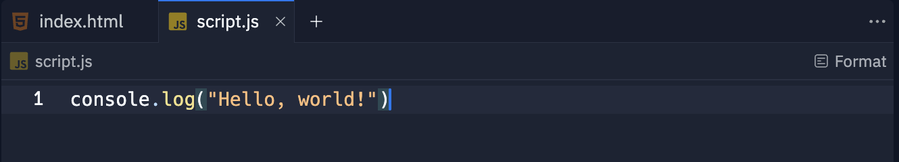
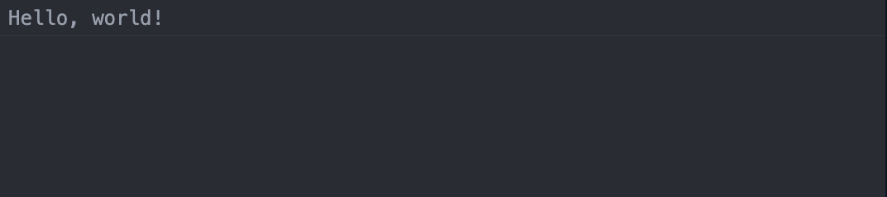
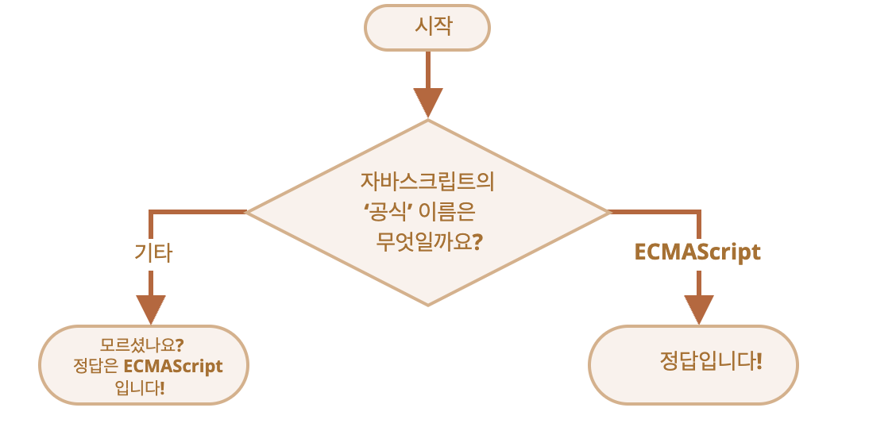

# JavaScript 기본

<!--
_footer: © 2024 by [Cha Haneum](https://github.com/chebread) is licensed under [CC BY 4.0](https://creativecommons.org/licenses/by/4.0/?ref=chooser-v1)
-->

---

# 목차

---

1. 실습 환경
2. Hello, world!
3. 코드 구조
4. 변수와 상수
5. 자료형
6. 형변환

---

7. 기본 연산자
8. 고급 연산자
9.  비교 연산자
10. 조건문
11. 논리 연산자
12. 마무리 정리
13. 질문
14. 출처

---

# 1. 실습 환경

---

<div style="text-align: center">


[https://replit.com/](https://replit.com/)에 접속해주세요.

</div>

---

<div style="text-align: center">

</div>

<br/>
구글 또는 깃허브로 로그인해주세요.

---

<div style="text-align: center">

</div>
<br/>

`Create Repl` 버튼을 눌러주세요.

---

<div style="text-align: center">

</div>
<br/>

`HTML, CSS, JS`를 선택한 후 `Create Repl`를 눌러주세요.

---

<div style="text-align: center">

</div>
<br/>

`script.js`를 클릭해주세요.

---

<div style="text-align: center">

</div>
<br/>

`DevTools`를 클릭해주세요.

---

<div style="text-align: center">

</div>
<br/>

`Console`를 클릭해주세요.

---

# 2. Hello, world!


---

```js
console.log("Hello, world!")
```

<div style="text-align: center">

</div>

이것 처럼 코드를 작성한 후, 상단의 `run` 버튼을 눌러주세요.

<div style="text-align: center">

</div>

---

<div style="text-align: center">

</div>

`Console`에 들어가시면, 결과를 볼 수 있습니다.

---

참고: `console.log`는 [Web API](https://developer.mozilla.org/en-US/docs/Web/API/)가 지원하는 브라우저의 Console에 메시지를 띄우는 함수입니다.

---

## 3. 코드 구조


---

## 문(statement)

문(statement)은 어떤 작업을 수행하는 문법 구조(syntax structure)와 명령어(command)를 의미합니다.


---

```js
console.log('Hello'); console.log('World');
```
아래 코드는 'Hello World’를 두 개의 alert 문으로 나눈 예시입니다.

---

```js
console.log('Hello');
console.log('World');
```

코드의 가독성을 높이기 위해 각 문은 서로 다른 줄에 작성하는 것이 일반적입니다.

---

## 세미콜론(semicolon)

세미콜론(semicolon)은 하나의 구문(statement)과 그 다음 구문의 구분을 위한 용도, 정확히는 하나의 구문을 종결(statement terminator)하는 용도로 쓰입니다.

---


```js
console.log('Hello');
console.log('World');
```

줄 바꿈이 있다면 세미콜론(semicolon)을 생략할 수 있습니다.
그러나, 많은 개발자들은 가독성과 안전성 때문에 세미콜론을 생략하지 않습니다.

---

## 주석(comment)

주석(comment)은 해당 코드를 설명해주기 위해 작성합니다.

---

```js
// Hello, world!

/*
  Hello, world!
*/
```

한 줄짜리 주석은 두 개의 슬래시 `//`로 시작하여 표현할 수 있습니다.
여러 줄의 주석은 슬래시와 별표 /*로 시작해 별표와 슬래시 */로 끝내어 표현할 수 있습니다.

---

# 4. 변수와 상수

---

## 변수

변수(variable)는 데이터를 저장할 때 쓰이는 ‘이름이 붙은 저장소’ 입니다. 온라인 쇼핑몰 애플리케이션을 구축하는 경우 상품이나 방문객 등의 정보를 저장할 때 변수를 사용합니다.

---


```js
var variable = ...
let variable = ...
const variable = ...
```

JavaScript에서는 어떤 타입(int, string, array, ...)이든지 `var, let, const` 키워드를 사용하여 저장할 수 있습니다.

`var, let` 은 전역 변수를 명명할 때, 비불변값을 명명할 때 사용합니다.
`const`는 지역 변수를 명명할 때, 불변값을 명명할 때 사용합니다.

---

```js
const helloWorld = "Hello, world!";
```

JavaScript에서는 주로 <span style="color: red;">*</span>`camelCase`를 사용하여 변수를 명명합니다.

`CamelCase`은 프로그래밍에서 파일, 변수, 함수 등 대상의 이름을 띄어쓰기 없이 짓기 위하여 따르는 관례인 [네이밍컨벤션의 하나](https://www.techtarget.com/whatis/definition/CamelCase)입니다.

---

```js

let имя = '...';
let 我 = '...';

```

키릴 문자, 심지어 상형문자도 변수명에 사용할 수 있습니다. 모든 언어를 변수명에 사용할 수 있습니다.

비 라틴계 언어도 변수명에 사용할 수 있지만 권장하진 않습니다.

---

```js
let let = 5; // 'let'을 변수명으로 사용할 수 없으므로 에러!
let return = 5; // 'return'을 변수명으로 사용할 수 없으므로 에러!
```

예약어(reserved name) 목록에 있는 단어는 변수명으로 사용할 수 없습니다. 이 단어들은 자바스크립트 내부에서 이미 사용 중이기 때문입니다.

예약어 예시: `let, class, return, function`


---

## 실습

기본: `Hello, world` 라는 문자열을 `str` 라는 비불변 변수에 담아 `console.log`로 출력해보세요.

심화: `str` 변수에 담아있는 `Hello, world!`를 `Hello, Korea!`로 변경하여 출력해보세요.

---

## 예시 답안

```
// 기본
let str = "Hello, world!";
console.log(str); // "Hello, world!"

// 심화
str = "Hello, Korea!"
console.log(str); // "Hello, Korea!"
```

---

# 5. 자료형

---

## 숫자형

```js
let n = 123;
n = 12.345;
```

숫자형(number type) 은 정수 및 부동소수점 숫자(floating point number)를 나타냅니다.

---


## 문자형

```js
let str = "Hello";
let str2 = 'Single quotes are ok too';
let phrase = `can embed another ${str}`;
```

자바스크립트에선 문자열(string)을 따옴표로 묶습니다.

---

따옴표는 세 종류가 있습니다.
큰따옴표: `"Hello"`
작은따옴표: `'Hello'`
<snap style="color: red;">역 따옴표(백틱, backtick)</span>: <code>\`Hello\`</code>

큰따옴표와 작은따옴표는 ‘기본적인’ 따옴표로, 자바스크립트에서는 이 둘에 차이를 두지 않습니다.

---

```js
let name = "John";

// 변수를 문자열 중간에 삽입
console.log(`Hello, ${name}!`); // Hello, John!

// 표현식을 문자열 중간에 삽입
console.log(`the result is ${1 + 2}`); // the result is 3

console.log("the result is ${1 + 2}");
// the result is ${1 + 2} (큰따옴표는 확장 기능을 지원하지 않습니다.)
```

역 따옴표로 변수나 표현식을 감싼 후 `${…}`안에 넣어주면, 아래와 같이 원하는 변수나 표현식을 문자열 중간에 손쉽게 넣을 수 있습니다.

---

## 불린형(Boolean)

```js
let nameFieldChecked = true;
let ageFieldChecked = false;
```

불린형(논리 타입)은 `true`와 `false` 두 가지 값밖에 없는 자료형입니다.

불린형은 긍정(yes)이나 부정(no)을 나타내는 값을 저장할 때 사용합니다. `true`는 긍정, `false`는 부정을 의미합니다.

---

## null 값

```js
let age = null;
```

자바스크립트에선 `null`을 ‘존재하지 않는(nothing)’ 값, ‘비어 있는(empty)’ 값, ‘알 수 없는(unknown)’ 값을 나타내는 데 사용합니다.

---

## undefined 값

```js
let age;
console.log(age); // 'undefined'가 출력됩니다.
```

`undefined`는 '값이 할당되지 않은 상태’를 나타낼 때 사용합니다.

변수는 선언했지만, 값을 할당하지 않았다면 해당 변수에 `undefined`가 자동으로 할당됩니다.

---

```js
let age = 100;

// 값을 undefined로 바꿉니다.
age = undefined;
console.log(age); // "undefined"
```

`undefined`를 직접 할당하는 걸 권장하진 않습니다. 변수가 ‘비어있거나’ ‘알 수 없는’ 상태라는 걸 나타내려면 `null`을 사용하세요. `undefined`는 값이 할당되지 않은 변수의 초기값을 위해 예약어로 남겨둡시다.

---

## typeof 연산자


```js
typeof undefined // "undefined"
typeof 0 // "number"
typeof true // "boolean"
typeof "foo" // "string"
typeof alert // "function"  (3)
```

typeof 연산자는 인수의 자료형을 반환합니다. 자료형에 따라 처리 방식을 다르게 하고 싶거나 변수의 자료형을 빠르게 알아내고자 할 때 유용합니다.

---

```js
console.log(type 0); // "number"
console.log(type(0));
```

typeof 연산자는 두 가지 형태의 문법을 지원합니다.
연산자: typeof x
함수: typeof(x)
괄호가 있든 없든 결과가 동일합니다.

typeof x를 호출하면 인수의 자료형을 나타내는 문자열을 반환합니다.

---

## 실습

1. `str`이라는 불변 변수에 `Hello, world!`를 저장하세요
2. `strType`이라는 불변 변수에 `str` 변수의 값을 `typeof` 함수를 사용하여 `str` 변수의 타입을 저장한 후 출력해보세요.

---

## 예시 답안

```js
const str = "Hello, world!";
const strType = typeof str;

console.log(strType); // "string"
```

---

# 6. 형 변환

---

## 문자형으로 변환

```js
let value = true;
console.log(typeof value); // boolean

value = String(value); // 변수 value엔 문자열 "true"가 저장됩니다.
console.log(typeof value); // string
```

`String(value)` 함수를 호출해 전달받은 값을 문자열로 변환 할 수도 있습니다.

---

## 숫자형으로 변환

```js
let str = "123";
console.log(typeof str); // string

let num = Number(str); // 문자열 "123"이 숫자 123으로 변환됩니다.

console.log(typeof num); // number
```

`Number(value)` 함수를 사용하면 주어진 값(value)을 숫자형으로 명시해서 변환할 수 있습니다.

---

## 불린형으로 변환

```js
console.log( Boolean(1) ); // 숫자 1(true)
console.log( Boolean(0) ); // 숫자 0(false)

console.log( Boolean("hello") ); // 문자열(true)
console.log( Boolean("") ); // 빈 문자열(false)
```

`Boolean(value)`를 호출하면 명시적으로 불리언으로의 형 변환을 수행할 수 있습니다.

---

## 실습

`num`이라는 불변 변수에 `123` 이라는 숫자를 저장한 후, `str`이라는 불변 변수에 `num` 변수에 저장된 `123`을 문자열로 변환하여 저장한 후 출력해보세요.

---

## 예시 답안

```js
const num = 123;
const str = String(num);

console.log(str); // "123"
```

---

# 7. 기본 연산자

---

## 사칙연산 연산자

```js
console.log(1 + 1); // 덧셈
console.log(2 - 1); // 뺄셈
console.log(3 * 2); // 곱셈
console.log(4 / 2); // 나눗셈
```

JavaScript는 기본 사칙연산 연산자(+, -, *, /)을 지원합니다.

---

## 나머지 연산자 %

```js
alert( 5 % 2 ); // 5를 2로 나눈 후의 나머지인 1을 출력
alert( 8 % 3 ); // 8을 3으로 나눈 후의 나머지인 2를 출력
```

나머지 연산자(remainder operator)는 % 기호로 나타내지만, 비율을 나타내는 퍼센트와 관련이 없습니다.

나머지 연산자를 사용한 표현식 a % b는 a를 b로 나눈 후 그 나머지(remainder)를 정수로 반환해줍니다.

---

## 거듭제곱 연산자 **

```js
alert( 2 ** 2 ); // 4  (2 * 2)
alert( 2 ** 3 ); // 8  (2 * 2 * 2)
alert( 2 ** 4 ); // 16 (2 * 2 * 2 * 2)

alert( 4 ** (1/2) ); // 2 (1/2 거듭제곱은 제곱근)
alert( 8 ** (1/3) ); // 2 (1/3 거듭제곱은 세제곱근)
```

거듭제곱 연산자(exponentiation operator)를 사용한 a ** b를 평가(코드가 계산 되어 값을 만드는 것)하면 a를 b번 곱한 값이 반환됩니다.

---

## 이항 연산자 '+'와 문자열 연결

```js
let s = "my" + "string";
alert(s); // mystring

alert( '1' + 2 ); // "12"
alert( 2 + '1' ); // "21"
```

JavaScript에서는 `+` 연산자는 문자열을 더하는 것도 수행합니다.

단, 이항 연산자(피연산자가 두 개인 연산자) +를 사용할 때는 피연산자( 연산자의 연산의 대상) 중 하나가 문자열이면 다른 하나도 문자열로 변환된다는 점에 주의해야 합니다.


---

```js
alert( 6 - '2' ); // 4, '2'를 숫자로 바꾼 후 연산이 진행됩니다.
alert( '6' / '2' ); // 3, 두 피연산자가 숫자로 바뀐 후 연산이 진행됩니다.
```

그러나, 다른 연산자(`-`, `/`, ...)들은 피연산자 중 하나가 문자열이더라도 숫자로 변환되어 계산됩니다.


---

## 단항 연산자 +와 숫자형으로의 변환

```js
// 숫자에는 아무런 영향을 미치지 않습니다.
let x = 1;
alert( +x ); // 1
let y = -2;
alert( +y ); // -2
// 숫자형이 아닌 피연산자는 숫자형으로 변화합니다.
// 이는 Number(...)와 동일한 일을 할 수 있게 해줍니다.
alert( +true ); // 1
alert( +"" );   // 0
```

덧셈 연산자 +는 이항 연산자뿐만 아니라 단항 연산자(피연산자가 한 개인 연산자)로도 사용할 수 있습니다. 숫자에 단항 덧셈 연산자를 붙이면 이 연산자는 아무런 동작도 하지 않습니다. 그러나 피연산자가 숫자가 아닌 경우엔 숫자형으로의 변환이 일어납니다.

---

## 연산자 우선순위

```js
1 + 2 * 2
```

하나의 표현식에 둘 이상의 연산자가 있는 경우, 실행 순서는 연산자의 우선순위(precedence) 에 의해 결정됩니다.

`1 + 2 * 2` 라는 식이 있을 때 곱셈이 먼저, 그 후에 덧셈이 일어난다는 것을 알고 계실 겁니다. 이런 개념이 연산자 우선순위입니다. 여기서 곱셈은 덧셈보다 더 높은 우선순위를 가지죠.

---

<div style="text-align: center">

</div>

더 자세한 연산자의 우선순위는 https://developer.mozilla.org/en-US/docs/Web/JavaScript/Reference/Operators/Operator_precedence#table를 참조해주세요.

---

# 8. 고급 연산자

---

## 할당 연산자

```js
let x = 2 * 2 + 1;

alert( x ); // 5
```

무언가를 할당할 때 쓰이는 `=`도 연산자입니다. 이 연산자는 할당(assignment) 연산자라고 불리는데, 우선순위는 3으로 아주 낮습니다.

`x = 2 * 2 + 1`과 같은 표현식에서 계산이 먼저 이뤄지고, 그 결과가 x에 할당되는 이유가 바로 이 때문입니다.

---

```js
let a = 1;
let b = 2;

let c = 3 - (a = b + 1);

alert( a ); // 3
alert( c ); // 0
```

위 예제에서 표현식 `(a = b + 1)`은 a에 값을 할당하고, 그 값인 3을 반환합니다. 그리고 반환 값은 이어지는 표현식에 사용됩니다.

---

## 할당 연산자 체이닝

```js
let a, b, c;

a = b = c = 2 + 2;

alert( a ); // 4
alert( b ); // 4
alert( c ); // 4
```

할당 연산자는 아래와 같이 여러 개를 연결(체이닝)할 수도 있습니다.

---

```js
c = 2 + 2;
b = c;
a = c;
```

그러나 되도록이면 연산자를 체이닝 하는것 보다 가독성을 위해 아래와 같이 줄을 나눠 코드를 작성하길 권유합니다.

이렇게 작성하면 읽기도 쉽고, 눈을 빠르게 움직이며 코드를 읽을 수 있습니다.

---

## 복합 할당 연산자

```js
let n = 2;
n = n + 5; // n = 7
n = n * 2; // n = 14
```

위의 코드에서 이해가 안되는 부분이 `n = n + 5` 일 것 입니다.
위의 표현식은 `n = 7`이라는 결과를 지닙니다.

---


```js
let n = 2;
n += 5; // n은 7이 됩니다(n = n + 5와 동일).
n *= 2; // n은 14가 됩니다(n = n * 2와 동일).

alert( n ); // 14
```

위의 코드는 `+=`와 `*=`연산자를 사용하면 짧은 문법으로 동일한 연산을 수행할 수 있습니다.

이런 ‘복합 할당’ 연산자는 산술 연산자와 비트 연산자에도 적용할 수 있습니다. `/=`, `-=` 등의 연산자를 만들 수 있습니다.

---

```js
let n = 2;

n *= 3 + 5;

console.log(n); // 16  (*=의 우측이 먼저 평가되므로, 위 식은 n *= 8과 동일합니다.)
```

복합 할당 연산자의 우선순위는 할당 연산자와 동일합니다. 따라서 대부분 다른 연산자가 실행된 후에 복합 할당 연산자가 실행됩니다.

---

## 증가 연산자

```js
let counter = 2;
counter++;      // counter = counter + 1과 동일하게 동작합니다. 하지만 식은 더 짧습니다.
console.log(counter); // 3
```

증가(increment) 연산자 `++`는 변수를 1 증가시킵니다.

참고로 증가·감소 연산자는 변수에만 쓸 수 있습니다. `5++`와 같이 값에 사용하려고 하면 에러가 발생합니다.

---

## 감소 연산자

```js
let counter = 2;
counter--;      // counter = counter - 1과 동일하게 동작합니다. 하지만 식은 더 짧습니다.
console.log(counter); // 1
```

감소(decrement) 연산자 `--`는 변수를 1 감소시킵니다.

---

++와-- 연산자는 변수 앞이나 뒤에 올 수 있습니다.

`counter++`와 같이 피연산자 뒤에 올 때는, '후위형(postfix form)'이라고 부릅니다.
`++counter`와 같이 피연산자 앞에 올 때는, '전위형(prefix form)'이라고 부릅니다.
후위형과 전위형은 피연산자인 counter를 1만큼 증가시켜 준다는 점에서 동일한 일을 합니다.

---

```js
let counter = 1;
alert( 2 * ++counter ); // 4

let counter = 1;
alert( 2 * counter++ ); // counter++는 '기존'값을 반환하기 때문에 2가 출력됩니다.
```

두 형의 차이는 ++/--의 반환 값을 사용할 때 드러납니다.

전위형은 증가·감소 후의 새로운 값을 반환하는 반면, 후위형은 증가·감소 전의 기존 값을 반환합니다.

그러나 연산이 끝난 후 n의 값은 둘 다 11로 같습니다.

---

<div style="text-align: center">

</div>

---

## 비트 연산자

```md
비트 AND ( & )
비트 OR ( | )
비트 XOR ( ^ )
비트 NOT ( ~ )
왼쪽 시프트(LEFT SHIFT) ( << )
오른쪽 시프트(RIGHT SHIFT) ( >> )
부호 없는 오른쪽 시프트(ZERO-FILL RIGHT SHIFT) ( >>> )
```

비트 연산자(bitwise operator)는 인수를 32비트 정수로 변환하여 이진 연산을 수행합니다.

비트 연산자는 저수준(2진 표현)에서 숫자를 다뤄야 할 때 쓰이므로 흔하게 쓰이진 않습니다. 웹 개발 시엔 이런 일이 자주 일어나지 않기 때문에 비트 연산자를 만날 일은 거의 없습니다.

---

## 쉼표 연산자

```js
let a = (1 + 2, 3 + 4);

alert( a ); // 7 (3 + 4의 결과)
```

쉼표 연산자(comma operator) ,는 좀처럼 보기 힘들고, 특이한 연산자 중 하나입니다. 코드를 짧게 쓰려는 의도로 가끔 사용됩니다.

위 예시에서 첫 번째 표현식 `1 + 2`은 평가가 되지만 그 결과는 버려집니다. `3 + 4`만 평가되어 `a`에 할당됩니다.

---

```js
// 한 줄에서 세 개의 연산이 수행됨
for (a = 1, b = 3, c = a * b; a < 10; a++) {
  // a = 1, b = 3을 한 후 c = a * b을 수행합니다.
  // 이처럼 쉼표 연산자가 코드의 간결화를 도와줍니다.
 ...
}
```

이렇게 마지막 표현식을 제외한 모든 것을 버리는 연산자는 여러 동작을 하나의 줄에서 처리하려는 복잡한 구조에서 이를 사용합니다.

---

## 실습

```js
let a = 2;

let x = 1 + (a *= 2);
```

아래 코드가 실행되고 난 후, a와 x엔 각각 어떤 값이 저장될까요?

---

## 예시 답안


```
a = 4 (기존 값(2)에 2를 곱한 4)
x = 5 (1 + 4의 결과)
```

---

## 실습

```js
let a = 1, b = 1;

let c = ++a; // ?
let d = b++; // ?
```

아래 코드가 실행된 후, 변수 a, b, c, d엔 각각 어떤 값들이 저장될까요?

---

## 예시 답안

```js
a = 2
b = 2
c = 2
d = 1
let a = 1, b = 1;

alert( ++a ); // 2, 전위형은 증가 후의 값을 반환합니다.
alert( b++ ); // 1, 후위형은 증가 전의 값을 반환합니다.

alert( a ); // 2, 값이 1만큼 증가합니다.
alert( b ); // 2, 값이 1만큼 증가합니다.
```

---

## 실습

```js
"" + 1 + 0
"" - 1 + 0
true + false
6 / "3"
"2" * "3"
4 + 5 + "px"
"$" + 4 + 5
"4" - 2
"4px" - 2
7 / 0
"  -9  " + 5
"  -9  " - 5
null + 1
undefined + 1
" \t \n" - 2
```

결과값을 예상해보세요.

---

## 예시 답안

```js
"" + 1 + 0 = "10" // (1)
"" - 1 + 0 = -1 // (2)
true + false = 1
6 / "3" = 2
"2" * "3" = 6
4 + 5 + "px" = "9px"
"$" + 4 + 5 = "$45"
"4" - 2 = 2
"4px" - 2 = NaN
7 / 0 = Infinity
"  -9  " + 5 = "  -9  5" // (3)
"  -9  " - 5 = -14 // (4)
null + 1 = 1 // (5)
undefined + 1 = NaN // (6)
" \t \n" - 2 = -2 // (7)
```

---

1. 피 연산자 중 하나가 문자열인 "" + 1에서 1은 문자형으로 변환됩니다. 따라서 공백과 문자열 1을 더한, "" + 1 = "1"과 같은 효과를 발휘하죠. 그다음 연산 "1" + 0에도 같은 규칙이 적용됩니다.
2. 뺄셈 연산자 -는 기타 수학 연산자처럼 숫자형만을 인수로 받습니다. 빈 문자열 ""는 숫자 0으로 변환되기 때문에 결과는 -1이 됩니다.
3. 피 연산자 중 하나가 문자열이므로 숫자 5가 문자열로 변환됩니다.

---

4. 뺄셈 연산자는 인수를 숫자형으로 변화시키므로 " -9 "는 숫자 -9로 변합니다. 앞, 뒤 공백은 제거되죠.
5. 숫자형으로 변환 시 null은 0이 됩니다.
6. undefined는 숫자형으로 변환시 NaN이 됩니다.
7. 문자열이 숫자형으로 변할 땐 문자열 앞뒤의 공백이 삭제됩니다. 뺄셈 연산자 앞의 피연산자는 공백을 만드는 문자 \t와 \n, 그 사이의 “일반적인” 공백으로 구성됩니다. 따라서 " \t \n"는 숫자형으로 변환 시 길이가 0인 문자열로 취급되어 숫자 0이 됩니다.

---

## 실습


```js
let a = prompt("덧셈할 첫 번째 숫자를 입력해주세요.", 1);
let b = prompt("덧셈할 두 번째 숫자를 입력해주세요.", 2);

alert(a + b); // 12
```

아래 코드는 사용자에게 숫자 2개를 입력받은 다음 그 합을 보여줍니다.

그런데 의도한 대로 예시가 동작하지 않습니다. 프롬프트 창에 세팅한 기본값을 수정하지 않은 경우 덧셈의 결과는 12가 됩니다.

왜 그럴까요? 예시가 제대로 동작하도록 코드를 수정해 보세요. 결과는 3이 되어야 합니다.

---

## 예시 답안

```js
let a = +prompt("덧셈할 첫 번째 숫자를 입력해주세요.", 1);
// 또는 let a = Number(prompt("덧셈할 첫 번째 숫자를 입력해주세요.", 1));
let b = +prompt("덧셈할 두 번째 숫자를 입력해주세요.", 2);

alert(a + b); // 3
```

```js
let a = prompt("덧셈할 첫 번째 숫자를 입력해주세요.", 1);
let b = prompt("덧셈할 두 번째 숫자를 입력해주세요.", 2);

alert(+a + +b); // 3
// 또는 alert(Number(a) + Number(b));
```

---

# 9. 비교 연산자

---

## 초과, 미만 연산자

```js
a > b // 초과
a < b // 미만
```

---

## 이상, 이하 연산자

```js
a >= b // 이상
a <= b // 이하
```

---

## 동등 연산자

```js
a == b
```

두 피연산자의 자료형을 일치시킨 후, 엄격하게 비교를 수행합니다.

`a ​​= b`와 같이 등호가 하나일 때는 할당을 의미합니다.

---

## 일치 연산자

```js
3 === 3   // true
3 === '3' // false
```

자료형 변환 없이 두 피연산자가 엄격히 같은지 판별합니다.

---

## 부등 연산자

```js
a != b
```

같지 않음을 나타내는 수학 기호 `≠`는 자바스크립트에선 `a != b`로 나타냅니다. 할당연산자 `=` 앞에 느낌표 `!`를 붙여서 표시합니다.

두 피연산자의 자료형을 일치시킨 후, 엄격하게 비교를 수행합니다.

두 피연산자가 같지 않으면 `true`을 반환합니다.

---

## 불일치 연산자

```js
3 !== '3' // true
4 !== 3   // true
```

자료형 변환 없이 두 피연산자가 엄격히 같은지 판별합니다.

두 피연산자가 같지 않거나, 같은 자료형이 아닐 때 `true`를 반환합니다.

---

## 동등 비교 연산자와 일치 비교 연산자의 차이점

```js
console.log(5 === 5)		//true
console.log(5 === '5')		//false (number, string)
console.log(5 !== '5')		//ture (number, string)
console.log(5 !== 5)		//false

console.log(5 == '5')		//true
console.log(5 != '5')		//false
console.log(5 != 5)		//false
console.log(5 != 0)		//true
```

---

정리하자면 동등 비교 연산자(==, !=)와 일치 비교 연산자(===, !==)의 가장 큰 차이점은 형변환을 하냐 안하냐입니다.

동등 비교 연산자(==, !=)는 형변환을 해 두 피연산자의 자료형을 일치시킨 뒤, 서로 같은지 비교를 진행합니다.

반면 일치 비교 연산자(===, !==)는 형변환을 하지 않은 상태에서 두 피연산자가 서로 같은지 비교를 진행합니다.

---

## 불린형 반환

```js
console.log( 2 > 1 );  // true
console.log( 2 == 1 ); // false
console.log( 2 != 1 ); // true
```

다른 연산자와 마찬가지로 비교 연산자 역시 값을 반환합니다. 반환 값은 불린형입니다.

true가 반환되면, ‘긍정’, ‘참’, '사실’을 의미합니다.
false가 반환되면, ‘부정’, ‘거짓’, '사실이 아님’을 의미합니다.

---

```js
let result = 5 > 4; // 비교 결과를 변수에 할당
console.log( result ); // true
```

반환된 불린값은 다른 여타 값처럼 변수에 할당 할 수 있습니다.

---

## 문자열 비교

```js
alert( 'Z' > 'A' ); // true
alert( 'Glow' > 'Glee' ); // true
alert( 'Bee' > 'Be' ); // true
```

자바스크립트는 ‘사전’ 순으로(정확히는 유니코드 순입니다.) 문자열을 비교합니다. '사전편집(lexicographical)'순이라고 불리기도 하는 이 기준을 적용하면 사전 뒤쪽의 문자열은 사전 앞쪽의 문자열보다 크다고 판단됩니다.

실제 단어를 사전에 실을 때 단어를 구성하는 문자 하나하나를 비교하여 등재 순서를 정하는 것과 같이 자바스크립트도 문자열을 구성하는 문자 하나하나를 비교해가며 문자열을 비교합니다.

---

문자열 비교 시 적용되는 알고리즘은 다음과 같습니다.

1. 두 문자열의 첫 글자를 비교합니다.
2. 첫 번째 문자열의 첫 글자가 다른 문자열의 첫 글자보다 크면(작으면), 첫 번째 문자열이 두 번째 문자열보다 크다고(작다고) 결론 내고 비교를 종료합니다.
3. 두 문자열의 첫 글자가 같으면 두 번째 글자를 같은 방식으로 비교합니다.
글자 간 비교가 끝날 때까지 이 과정을 반복합니다.
4. 비교가 종료되었고 문자열의 길이도 같다면 두 문자열은 동일하다고 결론 냅니다. 비교가 종료되었지만 두 문자열의 길이가 다르면 길이가 긴 문자열이 더 크다고 결론 냅니다.

---

## 다른 형을 가진 값 간의 비교

```js
alert( '2' > 1 ); // true, 문자열 '2'가 숫자 2로 변환된 후 비교가 진행됩니다.
alert( '01' == 1 ); // true, 문자열 '01'이 숫자 1로 변환된 후 비교가 진행됩니다.
```

JavaScript에서는 다른 언와는 다르게 유연합니다. 그러므로 다른 형을 가진 값과도 비교가 가능합니다. (그러나 이것은 프로덕트에서는 치명적으로 작용할 수 있으므로 이런 것을 예방하기 위해 개발자들은 JSDOC이나 TypeScript를 사용합니다.)

비교하려는 값의 자료형이 다르면 자바스크립트는 이 값들을 숫자형으로 바꿉니다.

---

```js
alert( true == 1 ); // true
alert( false == 0 ); // true
```

불린값의 경우 true는 1, false는 0으로 변환된 후 비교가 이뤄집니다.

---

## 비교가 불가능한 undefined

```js
alert( undefined > 0 ); // false (1)
alert( undefined < 0 ); // false (2)
alert( undefined == 0 ); // false (3)
```

undefined를 다른 값과 비교해서는 안 됩니다.

---

# 10. 조건문

---

## If 문

```js
let year = prompt('ECMAScript-2015 명세는 몇 년도에 출판되었을까요?', '');

if (year == 2015) alert( '정답입니다!' );
```

`if(…)`문은 괄호 안에 들어가는 조건을 평가하는데, 그 결과가 true이면 코드 블록이 실행됩니다.

---


```js
let cond = (year == 2015); // 동등 비교를 통해 true/false 여부를 결정합니다.

if (cond) {
  ...
}
```

`if(…)` 문은 괄호 안의 표현식을 평가하고 그 결과를 불린값으로 변환합니다.

---

## 'else’절

```js
let year = prompt('ECMAScript-2015 명세는 몇 년도에 출판되었을까요?', '');

if (year == 2015) {
  alert( '정답입니다!' );
} else {
  alert( '오답입니다!' ); // 2015 이외의 값을 입력한 경우
}
```

`if`문엔 `else` 절을 붙일 수 있습니다. `else` 뒤에 이어지는 코드 블록은 조건이 거짓일 때 실행됩니다.

---

## 'else if'절

```js
let year = prompt('ECMAScript-2015 명세는 몇 년도에 출판되었을까요?', '');

if (year < 2015) {
  alert( '숫자를 좀 더 올려보세요.' );
} else if (year > 2015) {
  alert( '숫자를 좀 더 내려보세요.' );
} else {
  alert( '정답입니다!' );
}
```

약간씩 차이가 있는 조건 여러 개를 처리해야 할 때가 있습니다. 이때 `else if`를 사용할 수 있습니다.

---

`else if` 블록을 더 많이 붙이는 것도 가능합니다. 그러나 처음에 붙는 `if`는 필수 사항이며, 마지막에 붙는 `else`는 필수가 아닌 선택 사항입니다.

---

## 조건부 연산자 ‘?’

```js
let accessAllowed;
let age = prompt('나이를 입력해 주세요.', '');

if (age > 18) {
  accessAllowed = true;
} else {
  accessAllowed = false;
}

alert(accessAllowed);
```

이처럼 조건에 따라 다른 값을 변수에 할당해줘야 할 때가 있습니다.

---

```js
let accessAllowed = (age > 18) ? true : false;
```

'물음표(question mark) 연산자’라고도 불리는 '조건부(conditional) 연산자’를 사용하면 이렇게 위 예시를 더 짧고 간결하게 변형할 수 있습니다.

---

```js
let accessAllowed = age > 18;
```

또한, 위 코드는 위의 예제와 동일하게 동작합니다.

---

## 다중 ‘?’

```js
let age = prompt('나이를 입력해주세요.', 18);

let message = (age < 3) ? '아기야 안녕?' :
  (age < 18) ? '안녕!' :
  (age < 100) ? '환영합니다!' :
  '나이가 아주 많으시거나, 나이가 아닌 값을 입력 하셨군요!';

alert( message );
```

물음표 연산자?를 여러 개 연결하면 복수의 조건을 처리할 수 있습니다.

---

```js
if (age < 3) {
  message = '아기야 안녕?';
} else if (age < 18) {
  message = '안녕!';
} else if (age < 100) {
  message = '환영합니다!';
} else {
  message = '나이가 아주 많으시거나, 나이가 아닌 값을 입력 하셨군요!';
}
```

if..else를 사용하면 위 예시를 아래와 같이 변형할 수 있습니다.

---

## 부적절한 ‘?’

```js
let company = prompt('자바스크립트는 어떤 회사가 만들었을까요?', '');

(company == 'Netscape') ?
   alert('정답입니다!') : alert('오답입니다!');
```

물음표?를 if 대용으로 쓰는 경우가 종종 있습니다.

조건 `company == 'Netscape'`의 검사 결과에 따라 `?` 뒤에 이어지는 첫 번째 혹은 두 번째 표현식이 실행되어 얼럿 창이 뜹니다.

그런데 이런 식으로 물음표 연산자를 사용하는 것은 좋지 않습니다.

---

```js
let company = prompt('자바스크립트는 어떤 회사가 만들었을까요?', '');

if (company == 'Netscape') {
  alert('정답입니다!');
} else {
  alert('오답입니다!');
}
```

개발자 입장에선 if문을 사용할 때 보다 코드 길이가 짧아진다는 점 때문에 물음표?를 if 대용으로 쓰는 게 매력적일 순 있습니다. 하지만 위의 예시처럼 코드를 작성하면 가독성이 떨어집니다.

---

## 실습

```js
if ("0") {
  alert( 'Hello' );
}
```

아래 코드에서 alert는 실행될까요?

---

## 예시 답안

```js
if ("0") {
  alert( 'Hello' );
}
```

비어있는 문자열을 제외한 모든 문자열은 논리 평가 시 true를 반환합니다. 문자 "0"은 비어있지 않은 문자열입니다. 그러므로 위 코드는 실행됩니다.

---

## 실습

if..else 구조를 이용해 "자바스크립트의 ‘공식’ 이름은 무엇일까요?"라는 질문을 하는 코드를 작성해 보세요.

사용자가 'ECMAScript’를 입력했다면 ‘정답입니다!’, 아니라면 '모르셨나요? 정답은 ECMAScript입니다!'라는 메시지를 보여주세요.

---

<div style="text-align: center">

</div>

---

## 예시 답안

```js
'use strict';
let value = prompt("자바스크립트의 '공식' 이름은 무엇일까요?", '');
if (value == 'ECMAScript') {
  alert('정답입니다!');
} else {
  alert("모르셨나요? 정답은 ECMAScript입니다!");
}
```

---

## 실습 

```js
let message;

if (login == '직원') {
  message = '안녕하세요.';
} else if (login == '임원') {
  message = '환영합니다.';
} else if (login == '') {
  message = '로그인이 필요합니다.';
} else {
  message = '';
}
```

조건부 연산자 '?'를 사용해 if..else문이 사용된 아래 코드를 변형해보세요.

---

## 예시 답안

```js
let message = (login == '직원') ? '안녕하세요.' :
  (login == '임원') ? '환영합니다.' :
  (login == '') ? '로그인이 필요합니다.' :
  '';
```

---

# 11. 논리 연산자

---

자바스크립트엔 세 종류의 논리 연산자 ||(OR), &&(AND), !(NOT)이 있습니다.

연산자에 '논리’라는 수식어가 붙긴 하지만 논리 연산자는 피연산자로 불린형뿐만 아니라 모든 타입의 값을 받을 수 있습니다. 연산 결과 역시 모든 타입이 될 수 있습니다.

---

##  || (OR)

```js
result = a || b;

alert( true || true );   // true
alert( false || true );  // true
alert( true || false );  // true
alert( false || false ); // false
```

OR 연산자는 불린값을 조작하는 데 쓰입니다. 인수 중 하나라도 true이면 true를 반환하고, 그렇지 않으면 false를 반환합니다.

---

```js
let hour = 9;

if (hour < 10 || hour > 18) {
  alert( '영업시간이 아닙니다.' );
}
```

OR 연산자 ||은 if문에서 자주 사용됩니다. 주어진 조건 중 하나라도 참인지를 테스트하는 용도로 자주 사용됩니다.

---

```js
let firstName = "";
let lastName = "";
let nickName = "바이올렛";

alert( firstName || lastName || nickName || "익명"); // 바이올렛
```

JavaScript는 `||` 연산자의 추가 기능을 지원합니다.

---

1. 가장 왼쪽 피연산자부터 시작해 오른쪽으로 나아가며 피연산자를 평가합니다.
2. 각 피연산자를 불린형으로 변환합니다. 변환 후 그 값이 true이면 연산을 멈추고 해당 피연산자의 변환 전 원래 값을 반환합니다.
3. 피연산자 모두를 평가한 경우(모든 피연산자가 false로 평가되는 경우)엔 마지막 피연산자를 반환합니다.
---

## && (AND)

```js
result = a && b;

alert( true && true );   // true
alert( false && true );  // false
alert( true && false );  // false
alert( false && false ); // false
```

 AND 연산자는 두 피연산자가 모두가 참일 때 `true`를 반환합니다. 그 외의 경우는 `false`를 반환합니다.

 ---

 ```js
 let hour = 12;
let minute = 30;

if (hour == 12 && minute == 30) {
  alert( '현재 시각은 12시 30분입니다.' );
}
```

이처럼 `if` 문에서도 자주 사용됩니다.

---

```js
alert( 1 && 2 && null && 3 ); // null

// 첫 번째 피연산자가 truthy이면,
// AND는 두 번째 피연산자를 반환합니다.
alert( 1 && 0 ); // 0
alert( 1 && 5 ); // 5

// 첫 번째 피연산자가 falsy이면,
// AND는 첫 번째 피연산자를 반환하고, 두 번째 피연산자는 무시합니다.
alert( null && 5 ); // null
alert( 0 && "아무거나 와도 상관없습니다." ); // 0
```

JavaScript에서는 `&&` 연산자의 추가기능을 지원합니다.

---

1. 가장 왼쪽 피연산자부터 시작해 오른쪽으로 나아가며 피연산자를 평가합니다.
2. 각 피연산자는 불린형으로 변환됩니다. 변환 후 값이 false이면 평가를 멈추고 해당 피연산자의 변환 전 원래 값을 반환합니다.
3. 피연산자 모두가 평가되는 경우(모든 피연산자가 true로 평가되는 경우)엔 마지막 피연산자가 반환됩니다.

---

## ! (NOT)

```js
alert( !true ); // false
alert( !0 ); // true
```

NOT 연산자는 인수를 하나만 받고, 다음 순서대로 연산을 수행합니다.

1. 피연산자를 불린형(true / false)으로 변환합니다.
2. 1에서 변환된 값의 역을 반환합니다.

---

```js
alert( !!"non-empty string" ); // true
alert( !!null ); // false
```

NOT을 두 개 연달아 사용(!!)하면 값을 불린형으로 변환할 수 있습니다.

---

```js
alert( Boolean("non-empty string") ); // true
alert( Boolean(null) ); // false
```

`!!`는 내장 함수 `Boolean`을 사용하면 `!!`을 사용한 것과 같은 결과를 도출할 수 있습니다.

---

## nullish 병합 연산자 '??'

```js
x = a ?? b;
// x = (a !== null && a !== undefined) ? a : b; 와 동일합니다
```

`??` 연산자는 a가 null도 아니고 undefined도 아니면 a를 반환하며, 그 외의 경우는 b를 반환합니다.

이를 사용하면 짧은 문법으로 여러 피연산자 중 그 값이 ‘확정되어있는’ 변수를 찾을 수 있습니다.

---

## '??'와 '||'의 차이점

||는 첫 번째 truthy 값을 반환합니다. 그러나 ??는 첫 번째 정의된(defined) 값을 반환합니다.

---

```js
height = height ?? 100;
```

`??`를 사용하면, height에 값이 정의되지 않은경우 height엔 100이 할당됩니다.

---

```js
let height = 0;

alert(height || 100); // 100
alert(height ?? 100); // 0
```

`||`을 사용하면, height에 0을 할당했지만 0을 falsy 한 값으로 취급했기 때문에 null이나 undefined를 할당한 것과 동일하게 처리합니다. 따라서 height || 100의 평가 결과는 100입니다.

---

## 실습

```js
alert( null || 2 || undefined );
```

아래 코드의 결과를 예측해 보세요.

---

## 예시 답안


```js
alert( null || 2 || undefined ); // 2
```

피연산자 중 첫 번째 truthy인 2가 출력됩니다.

---

```js
alert( 1 && null && 2 );
```

아래 코드의 결과를 예측해 보세요.

---

```js
alert( 1 && null && 2 );
```

피연산자 중 첫 번째 falsy인 null이 출력됩니다.

---

## 실습

```js
alert( null || 2 && 3 || 4 );
```

아래 코드의 결과를 예측해 보세요.

---

## 예시 답안

얼럿 창엔 3이 출력됩니다.

`alert( null || 2 && 3 || 4 );`
AND 연산자 &&의 우선순위는 ||보다 높습니다. 따라서 &&가 먼저 실행됩니다.

---

## 실습

age(나이)가 14세 이상 90세 이하에 속하는지를 확인하는 if문을 작성해보세요.

---

## 예시 답안

```js
if (age >= 14 && age <= 90)
```

---

## 실습

프롬프트(prompt) 대화상자를 이용해 간이 로그인 창을 구현해보세요.

---

사용자가 "Admin"를 입력하면 비밀번호를 물어보는 프롬프트 대화상자를 띄워주세요. 이때 아무런 입력도 하지 않거나 Esc를 누르면 "취소되었습니다."라는 메시지를 보여주세요. 틀린 비밀번호를 입력했다면 "인증에 실패하였습니다."라는 메시지를 보여주세요.

---

비밀번호 확인 절차는 다음과 같습니다.

1. 맞는 비밀번호 "TheMaster"를 입력했다면 "환영합니다!"라는 메시지를 보여주세요.
2. 틀린 비밀번호를 입력했다면 "인증에 실패하였습니다."라는 메시지를 보여주세요.
3. 빈 문자열을 입력하거나 입력을 취소했다면 "취소되었습니다."라는 메시지를 보여주세요.

중첩 if 블록을 사용하고, 코드 전체의 가독성을 고려해 답안을 작성하세요.

힌트: 프롬프트 창에 아무것도 입력하지 않으면 빈 문자열인 ''가, ESC를 누르면 null이 반환됩니다.

---

<div style="text-align: center">

</div>

---

## 예시 답안

```js
let userName = prompt("사용자 이름을 입력해주세요.", '');

if (userName == 'Admin') {

  let pass = prompt('비밀번호:', '');

  if (pass == 'TheMaster') {
    alert( '환영합니다!' );
  } else if (pass == '' || pass == null) {
    alert( '취소되었습니다.' );
  } else {
    alert( '인증에 실패하였습니다.' );
  }

} else if (userName == '' || userName == null) {
  alert( '취소되었습니다.' );
} else {
  alert( "인증되지 않은 사용자입니다." );
}
```

---


# 12. 마무리 정리

---

오늘은 **코드 구조, 변수와 상수, 자료형, 형변환, 연산자, 조건문**에 대해서 소개해보았습니다.

다음 시간이 **함수, 클래스, 메서드, Iterator, Generator, Property, Proxy, Prototype, try...catch, Promise**에 대해 알려드리도록 하겠습니다.

---

# 13. 질문

궁금한 점에 대해 질문부탁드립니다.

또는, 개인 이메일([chahanm@proton.me](mailto:chahanm@proton.me))로 질문하셔도 됩니다.

---

# 14. 출처

- [Modern JavaScript Tutorial(https://ko.javascript.info/)](https://ko.javascript.info/)

---

# 이상입니다.